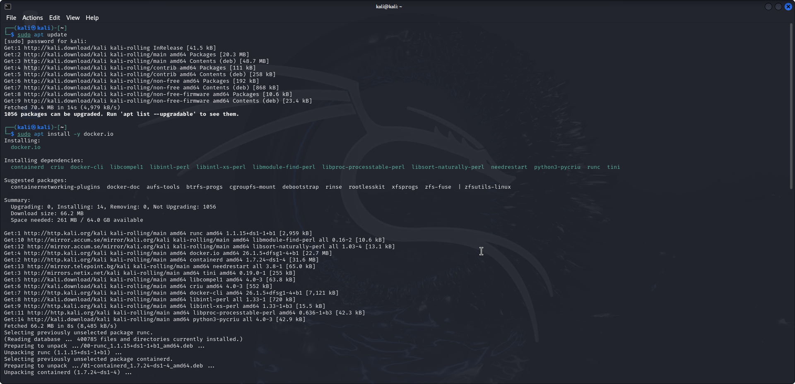
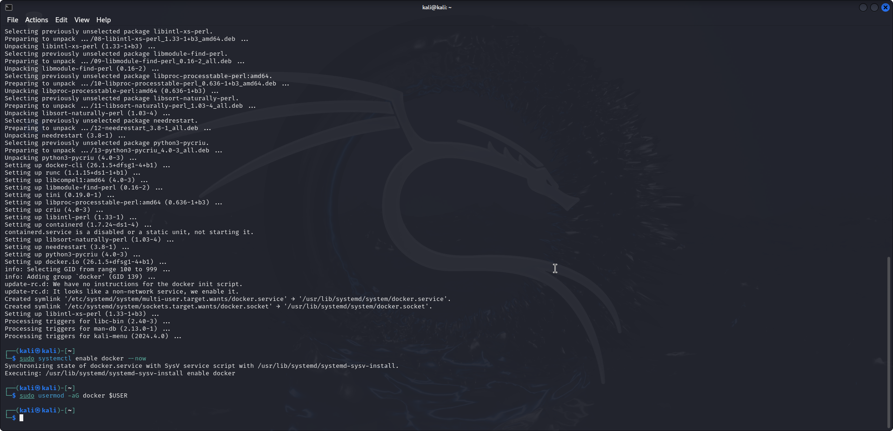
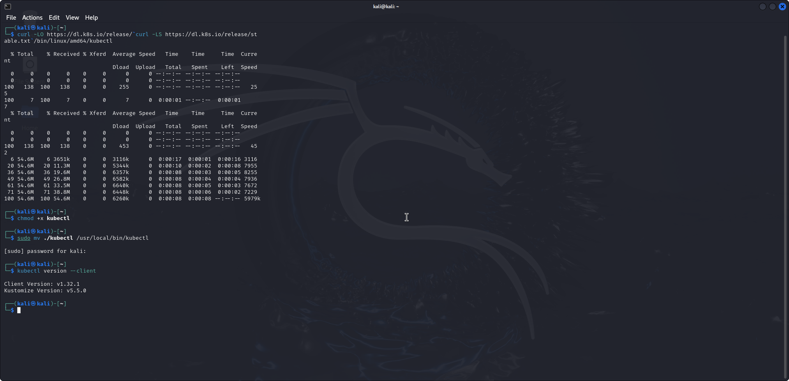
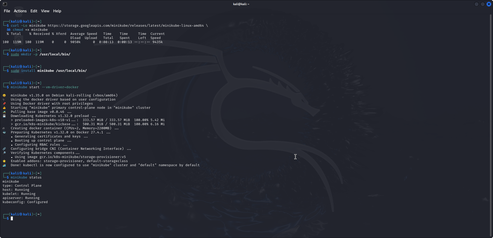
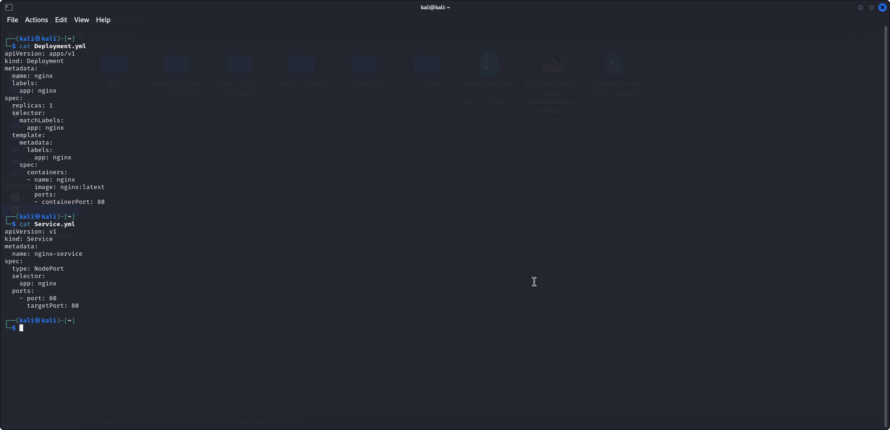
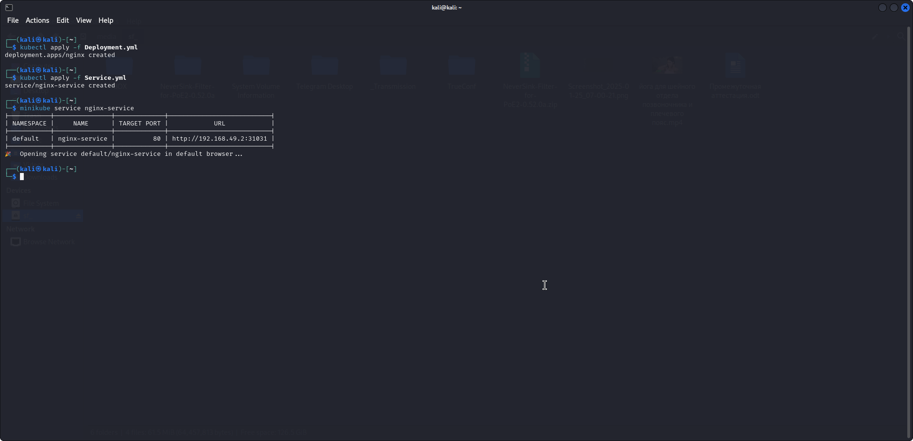
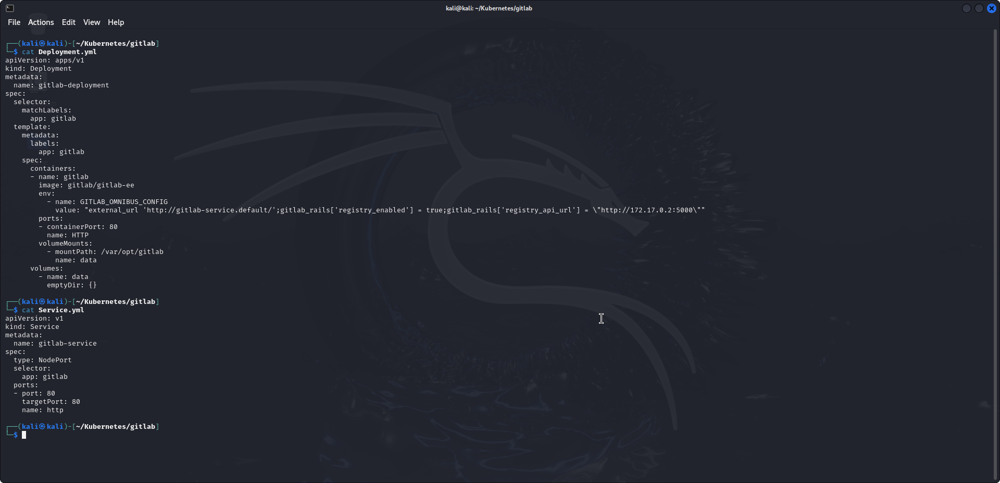
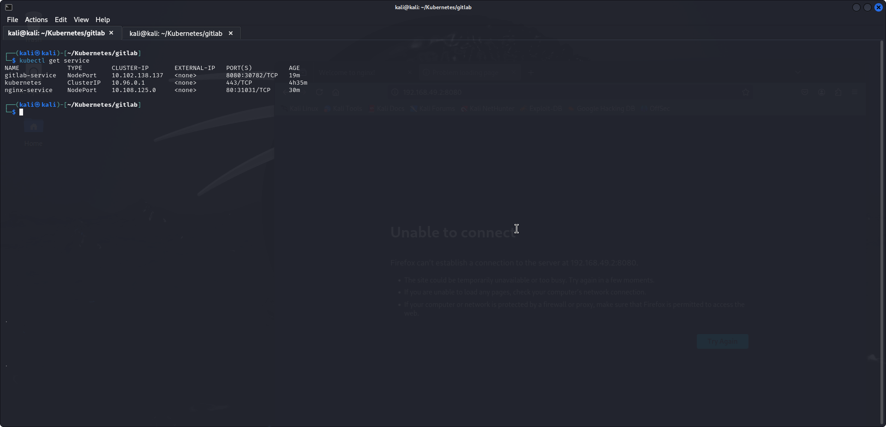

# DevSecOps_Attestation_1

## 0 - Уствновка Docker
Для работы кластера k8s установим Docker.

После установки Docker разрешим автозапуск службы и управление ей текущим пользователем.

## 1 - kubectl и minikube

Установим kubectl для того, чтобы иметь возможность управлять minikube.

После установки kubectl установим minikube с драйвером docker и проверим его работоспособность.

## 2 - создание nginx Deployment'a
Создадим nginx Deployment и Service

Проверим статус контейнера Nginx

## 3 - Установка GitLab
Создадим Delpoyment и Service для GitLab

Проверим статусы контейнеров Nginx и GitLab
